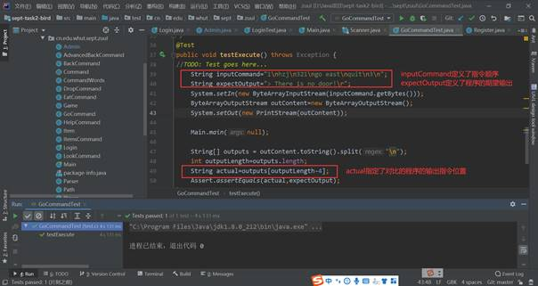

# 软件工程实训任务二：小组协同开发

## 1. 任务分析

### 1.1 物品与look命令

- 每个房间有物件，每个物件有重量和描述，可通过look命令查看房间信息与物品。该功能主要涉及两个新元素：物件和look命令。

- 物件需要创建一个Item类，有描述与重量两个成员属性。

- Look命令则需要继承Command类，然后补充其中的execute()函数，通过调用currentRoom的getItem()方法来获取当前房间的物品，然后打印出来。

 

### 1.2 back与advanceBack命令

- 创建新命令的思路大体都类似，就是创建新类来继承Command类，然后在CommandWords类的哈希表中添加匹配。

- 如果仅仅实现一个Back命令，将用户带到上一个房间，可以只在Game里面创建一个变量prevRoom来存储上一个房间。但是因为需要能将用户带到前几个房间。因此多创建了一个类Path来对路径进行存储。有两种数据结构可以选择，一种是LinkList，另外一种是HashMap。经过讨论小组使用了HashMap和一个int型变量pathNumber来对路径进行记录。


### 1.3 随机传送功能

- 小组决定创建一个Tp命令来对用户进行随机传送。而在TpCommand里，使用随机数来决定用户会被传送到哪一个房间，随机数生成范围是[0,4]，当生成0的时候被传送到北方的房间，其他方向类似。


### 1.4 玩家Player

- 主要的属性有名称，当前房间和负重值。考虑到还有take和drop命令，需要记录当前玩家所持有的物品，使用数据结构HashMap来记录。同时因为还有eat命令，所以需要创建函数use()来表示玩家使用物品的行为。


### 1.5 地图设计

- 先设计出新地图草图，然后在Game类的createRooms()里按照新地图执行对应的函数创建房间。


### 1.6 玩家登陆，数据库设计

- 该功能需要额外创建一个Admin类，用来指定每个游戏玩家，同时定义Login对象来操作Admin对象执行登录操作，登录的核心就是利用select查询语句，而Register类则介于Admin和Login之间，Register拥有Login的属性，但是不能操作Admin对象，只能操作Admin的内置属性，同时Register的核心就是执行insert插入语句的操作。登录以及注册功能的实现都是需要使用jdbc驱动来连接mysql数据库。


### 1.7 单元测试

- 通过idea的插件Junit自动生成选择类的单元测试模板，然后在指定类的待测试功能函数下面添加测试代码，每次测试只要按照预期的输入输出以及输出字段的顺序位置设定，最后运行对应函数测试代码段，通过观察测试结果来判断测试的正确与否。


### 1.8 额外功能

- 设计了player玩家的体力值，玩家每走一个房间就会减少相应体力。设计trap房间，进入trap房间的人会直接遭受恶龙的攻击，在体力和负重方面会有相应的减少。


## 2. 任务计划与分工

|                             分工                             |  姓名  |
| :----------------------------------------------------------: | :----: |
|        Player类的基本设计，check和take命令，代码merge        |  何灏  |
|           Item类的基本设计，look命令，随机传送功能           |  马冲  |
| drop和eat命令，Player类额外功能的设计，陷阱房间trap的设计、代码测试 |  雷冠  |
|        back和advanceBack命令，游戏地图设计、代码注释         | 朱志凌 |
|          玩家登陆与注册，数据库设计与实现、单元测试          | 黄子健 |


- issue发布


## 3. 项目成果

### 3.1 实现用户登录注册

- 定义玩家类：作为游戏的玩家，每个玩家应该对应一个用户对象，所以首先创建一个用户类，这里我用的是Admin管理员类（其实和游戏玩家一个道理）。Admin用户类的定义如图一所示：


- 定义登录Login类：为了体现出面向对象的优势，我们将Login定义为一个登录类对象，该对象可以操作Admin玩家对象，帮助Admin对象完成游戏的登录，该对象可以通过setAdmin函数来设定某一次游戏的登录玩家。同时，为Login对象配置远程服务器的mysql数据库服务，Login通过查询远程服务器的用户数据看是否能和当前Admin对象信息匹配来确定是否能成功登录系统。核心代码逻辑如下，Login这一过程主要就是对mysql数据库的查询操作：


- 定义Register注册类：Register注册类有点类似Admin用户类，Register同样包含了注册用户的各种信息，包括用户名、密码、以及用户注册时确定的密码，然后通过这一系列数据，分析其业务逻辑来判断用户是否注册成功。与此同时，Register类有带有了Login的某些性质，因为二者的操作都是面向数据库的，Login是属于查询数据库，而Register是向数据库中插入数据。

  **判断注册账户是否符合规则的逻辑代码：**

  

  **插入注册用户数据核心代码：**

  

  **实现远程数据库信息存储：**

  远程主机地址122.51.255.207，mysql开放服务端口3306，事先为本项目创建一个数据库，命名为septtask2bird，创建user数据表，存储游戏玩家信息。然后通过用户名和密码进行远程连接到数据库septtask2bird，之后对user表做一系列增删改查的操作。

  

  **绘制Admin、Login以及Register类对象的uml类图：**

  

  **相比于整个项目的uml类图（因为类图规模太大所以每个类对象中的属性以及方法就没做显示）：**

  

  **Idea** **控制台测试玩家的注册以及登录操作**

  登录：

  

  登录时意外情况的逻辑处理：

  

   

   

  注册：

  

   

   

  注册失败时的逻辑处理：

  

   

   

  从上面的登录注册的一系列操作，不难发现项目二与原始代码的提示有很大的改观，这里程序刚开始的时候我通过输入数字来确定玩家的指令，1表示登录系统，2表示注册账户，3表示退出系统。从以上截图体现的逻辑顺序中可以总结出：玩家登录失败后系统提示用户名或密码错误，此时系统会告诉用户是否还要继续进行下去，继续的话系统就会重新让用户选择指令，只要用户不输入指令3，那么系统就会一直运行。另一方面，用户注册成功的话就可以直接进入系统，而不需要和现代化软件一样需要再进行一次登录方可进入系统。同样的，如果注册失败（这里我们展示的是由于用户两次输入的密码不一致而导致的注册失败），系统也会给出现相应的提示。

   

   

  **单元测试：**

  Ø 测试框架可以帮助我们对编写的程序进行有目的地测试，帮助我们最大限度地避免代码中的bug，以保证系统的正确性和稳定性。

  Ø 很多人对自己写的代码，测试时就简单写main，然后sysout输出控制台观察结果。这样非常枯燥繁琐，不规范。缺点：测试方法不能一起运行，测试结果要程序猿自己观察才可以判断程序逻辑是否正确。

  Ø JUnit的断言机制，可以直接将我们的预期结果和程序运行的结果进行一个比对，确保对结果的可预知性。

   

   

  安装JunitGenerator V2.0插件后，我们还需要导入idea中自带的Junit的jar包才能享用Junit提供的单元测试服务，同时记得修改一下Junit的配置文件。

  我们选择希望测试的类，然后快捷键alt+insert，我们选择Junit Test中的Junit4：

  

   

  之后Junit为我们自动生成单元测试的模板代码，我们将测试代码放入对应的测试函数结课，测试代码模板如下：

  

   

  这里我们展示一下对GoCommand类中execute函数执行的go指令做的单元测试：

  

  执行GoCommandTest.java中的testExecute函数，系统输出的倒数第四行正好匹配上了文本“> There is no door!”。除此之外，我还做了其他类功能的单元测试。同理我们也可以对多种情况同时做单元测试，这样可以很大程度提高我们的代码测试效率。

   


### 3.2 Player类与check命令

- Player类

根据功能需求，需要有上述的成员变量和成员函数。其中一个Player可以拥有多个物品，因此使用数据结构ArrayList来储存。同时因为物品负重有上限，因此增加nowWeight和maxWeight来表示当前重量和最大负重量。另外为了后面实现tak命令，需要对外暴露addItem方法。其中在添加物品时先检查是否超出最大负重量，然后再进行相应操作。

- UML


- 基本属性


- 运行结果


- CheckCommand

需求是创建一个新的命令使得用户可以查看当前房间和用户持有的物品及其重量。基本思路就是按照项目结构，创建CheckCommand类来继承Command，然后实现其缺失的execute方法。此时之前在Player类里编写的getItem()方法就有用处了，通过该方法获取所有持有的Item，然后再将他们一一打印。

- 运行结果


- UML


### 3.3 Player类扩充

- Drop功能

  根据功能需求，需要丢掉player身上的物品，根据选择丢一件和丢几件的区别写出两个函数，可以通过player调用，注意删掉背包物品的同时要更新玩家的nowWeight来实现真正的丢掉物品。

```java
     /** 丢弃全部物品.
     */
    public void dropItem() {
        if (bag.isEmpty()) {
            System.out.println("Sorry,you have nothing to drop.");
        } else {
            bag.clear();
            setNowWeight(0);
        }
    }

    /**
     * 丢弃某件物品.
     * @param name 物品名称.
     */
    public void dropItem(String name) {
        Item item = bag.get(name);
        bag.remove(name);
        if (item != null) {
            int lastweight = getNowWeight() - item.getWeight();
            setNowWeight(lastweight);
            System.out.println("You drop something named "+ name);
            System.out.println("Now you're carrying " + getNowWeight() + " weights goods");
        }
        else
            System.out.println("sorry,you don't have it");
    }

```

```java
package cn.edu.whut.sept.zuul;

import java.util.Scanner;

/**
 * 丢弃物品命令类.
 * 可以选择丢弃一件物品或者全部物品.
 */
public class DropCommand extends Command
{
    public boolean execute(Game game) {
        Scanner input = new Scanner(System.in);
        Player player = game.getPlayer();
        System.out.println("You want to discard 1. One item 2. All items?");
        System.out.print("> ");
        int choose = Integer.parseInt(input.next());
        if(choose == 1){
            Scanner input2 = new Scanner(System.in);
            System.out.print("Please input the item's name:");
            String inputLine = input2.nextLine();
            player.dropItem(inputLine);
        }
        else if(choose == 2)
            player.dropItem();
        return false;
    }
}
```


- eat功能

  根据功能需求，需要判断物品是不是magic cookie，如果是，承重能力翻倍，如果不是，则对player的体力值和承重进行相应改变

```java
/**
 * 吃魔法饼干命令类.
 * 玩家吃掉魔法饼干，可增加负重能力.
 */
public class EatCommand extends Command {
    public boolean execute(Game game) {
        Scanner input = new Scanner(System.in);
        Player player = game.getPlayer();
        if (!hasSecondWord()) {
            System.out.println("eat anything?");
            String name = input.nextLine();
            player.use(name);
            return false;
        }
        return false;
    }
}
```

```java
/**
     * 使用物品.
     * @param name 物品名称.
     */
    public void use(String name) {
        Item item = bag.get(name);
        bag.remove(name);

        if (item != null) {
            if (item.getName().equals("Magic cookie")) {
                System.out.println("You eat a magic cookie!");
                int maxweight = getMaxWeight();
                maxweight = maxweight * 2;
                setMaxWeight(maxweight);
                System.out.println("Now you have " + maxweight + " maximum load bearing capacity");
            } else {
                if (item.getStrength() != 0) {
                    int lastStrength = strength;
                    strength += item.getStrength();
                    if (strength - lastStrength < 0) {
                        System.out.println("You lost " + (lastStrength - strength) + " points of energy.");
                    } else {
                        System.out.println("You gained " + (strength - lastStrength) + " points of energy.");
                    }
                    System.out.println("Now you have " + strength + " points of energy.");
                }
                if (item.getWeight() != 0) {
                    int lastweight = getNowWeight();
                    lastweight -= item.getWeight();
                    setNowWeight(lastweight);
                    System.out.println("Now you're carrying " + lastweight + " weights goods");
                }
            }
        } else {
            System.out.println("You don't have anything like " + name + ".");
        }

```


- 新建trap来实现陷阱房间

```java
/**
 * 陷阱类.
 * 构造房间内的陷阱.
 */
public class Trap {
    private String name;
    private int strengthDown;
    private int weightDown;

    /**
     * 构造陷阱效果.
     * @param name 陷阱名称.
     * @param strengthDown 体力减少值.
     * @param weightDown 负重值减少值.
     */
    public Trap(String name, int strengthDown, int weightDown) {
        this.name = name;
        this.strengthDown = strengthDown;
        this.weightDown = weightDown;
}

    /**
     * 得到体力值减少值.
     * @return 返回体力值减少值.
     */
    public int getStrengthDown() {
        return this.strengthDown;
}

    /**
     * 得到生命值/负重值减少值.
     * @return 返回命值/负重值减少值.
     */
    public int getWeightDown() {
        return this.weightDown;
    }

    /**
     * 得到陷阱名称.
     * @return 返回陷阱名称.
     */
    public String getName() {
        return this.name;
    }
}

```


### 3.4 Back与AdvanceBack命令

- 游戏命令类采用继承Command虚拟类的方法进行扩充，在进行命令使用的时候添加需要辅助命令的类，功能分离。


- 由于返回命令需要返回上一个房间，因此此命令需要路径来辅助实现，因此建立路径类用于存放玩家途径的房间，用于后续的返回命令展示房间。利用HashMap建立路径数与返回房间的路径表，并且对进入房间次数进行统计，便于后续返回判定，也可以用于判断是否返回至起点。


- 借助Path类存储的玩家路径，将路径方向进行逆转，就可以实现单次的back返回上一个房间的命令，游戏设定中，前往下一个房间和返回上一个房间都会消耗体力值五点。存储路径的判断使得多次使用back命令可以回到起点。


- 建立更高级的back命令advanback，可以逐层回退几个房间，直到把玩家带回到游戏的起点。


- 使用advanback命令，借助back命令，判断路径数，逐个房间返回，直到回到起点，需要注意的是，每层回退都会消耗体力值。


### 3.5 扩充地图

- 建立游戏地图，玩家来到了黑咒岛的边缘，这个岛被悬崖环绕，北面只有一座破旧的古石门，微弱的呼唤着玩家，你已经决定了，开始冒险。每个房间都会给出当前房间的描述，房间相互连接构成游戏地图，玩家将要根据判断进行游戏，设计地图使得目前有25个房间，包括23个普通房间，1个陷阱房间，1个随机传送房间。


| **Trap room**              | **name**      | **strengthDown** | **weightDown** |
| -------------------------- | ------------- | ---------------- | -------------- |
| The magic monastic grounds | Rotten Dragon | 50               | 50             |

| **Item room**                     | **name**                          | **strength** | **weight** |
| --------------------------------- | --------------------------------- | ------------ | ---------- |
| The spiral of meeting demons      | Cursed thing                      | -10          | 5          |
| The resting place of the soldiers | Mysterious inscription            | 15           | 15         |
| The burning path of the traveler  | Burning sword                     | 15           | 25         |
| The forgotten factory             | The book of time                  | 15           | 5          |
| The city of memory                | Magic cookie                      | 25           | 5          |
| The sky of fear                   | Magic cookie                      | 25           | 5          |
| The hidden home of the awakened   | Scepter of the elderly            | 10           | 15         |
| The foreign capital of tribe      | Secret history of ancient capital | 0            | 10         |
| The miasmatic temple              | Colorless liquid medicine         | -5           | 5          |

- 建立各个房间存放的物品表格，便于后续统计与改进，物品中包含物品名称、可以改变玩家体力值、物品重量三个信息，玩家可以使用物品改变体力值，背包内物品重量不能超过玩家最大负重值，否则会导致死亡。物品有例如炎剑、时之书等增加体力的增益类型，也有无色药水，诅咒恶梦等减益类型，同时存在魔法饼干物品可以增加玩家负重能力。
- 玩家为了获取游戏胜利，必须找到携带Mysterious inscription物品携带至最终房间。


### 3.6 随机传送及Item类

- 随机传送功能：当玩家进入随机传送房间时，即刻进行了传送，从地图上可以反映出。
- 开始游戏，根据地图路径第一次进入传送方时，观察玩家所处房间位置的变化情况。


- 游戏内增加物品元素、增加Look指令进行查看。
- 输入look指令，Meeting demons房间有一个物品。


